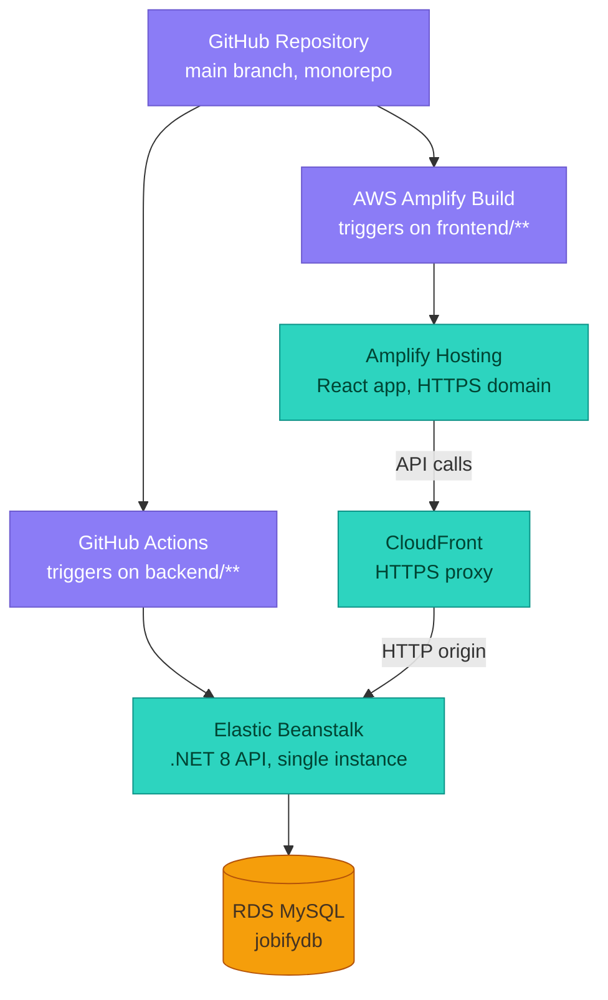

# TalentAI 🚀

**AI-Powered Talent and Recruitment Platform**


TalentAI is a comprehensive, enterprise-grade recruitment platform designed to bridge the gap between Job Seekers, Recruiters, and Hiring Managers. By leveraging the **Google Gemini AI LLM**, the platform automates resume screening, ranks candidates based on match scores, and provides a seamless WebRTC/SignalR-powered video interview hub.

---

## 🌟 Key Features

- **Role-Based Access Control (RBAC):** Distinct, secure dashboards for Admin, Hiring Managers, Recruiters, and Job Seekers.
- **AI Resume Screening:** Automatically parses uploaded resumes and generates a candidate-to-job match score using Google Gemini AI.
- **AI Suite:** Resume parsing, job-match scoring, HM resume screening, candidate ranking, auto-generated interview questions, and AI-generated job descriptions.
- **Real-Time Video Interviews:** Built-in video chat rooms (`VideoHub` over SignalR) for seamless remote interviewing, with calendar sync for scheduling.
- **Advanced Recruitment Pipelines:** Status-based pipeline management (Applied ➔ Screened ➔ Interviewed ➔ Offered).
- **Talent Pools & Job Requisitions:** Recruiters can maintain shortlists and manage requisitions raised by hiring managers.
- **Messaging & Notifications:** In-app messaging between roles plus a notification center with unread badges.
- **System Governance:** A global Admin dashboard for tracking system health, AI usage logs, infrastructure stats, and managing users/organizations.

---

## 🏗️ Architecture & Tech Stack

**Frontend**
- React 18 + Vite (fast HMR, TypeScript)
- Tailwind CSS (utility-first styling, glassmorphism UI)
- React Router
- Recharts (dashboards & analytics)
- lucide-react (icon set)

**Backend**
- ASP.NET Core 8 Web API (Clean Architecture: API / Application / Domain / Infrastructure)
- Entity Framework Core (code-first ORM, automatic migrations on startup)
- MySQL 8 (relational database)
- SignalR (real-time WebSockets for video rooms)
- JWT Bearer Authentication
- Google Gemini API (AI resume analysis, candidate ranking, JD generation)

---

## ☁️ AWS Deployment Architecture

The platform is deployed entirely on AWS, with separate CI/CD pipelines for the frontend and backend that converge at runtime behind an HTTPS edge.



**Why CloudFront?** Elastic Beanstalk's default single-instance URL only serves plain HTTP. Since the frontend is served over HTTPS (via Amplify), browsers block "mixed content" calls from an HTTPS page to an HTTP API. CloudFront sits in front of Elastic Beanstalk purely to terminate HTTPS and forward requests to the backend over HTTP, with caching disabled since API responses are dynamic and user-specific.

| Layer | Service | Notes |
|---|---|---|
| Frontend hosting | AWS Amplify | Auto-builds on push to `frontend/**`, free HTTPS domain |
| Backend hosting | AWS Elastic Beanstalk | .NET 8 on Amazon Linux 2023, single instance (free-tier eligible) |
| HTTPS edge | Amazon CloudFront | Proxies HTTPS → HTTP so the browser doesn't block mixed content |
| Database | Amazon RDS (MySQL) | `db.t4g.micro`, single-AZ, free-tier eligible |
| CI/CD | GitHub Actions | Publishes and zips the API, deploys via `beanstalk-deploy` action |

---

## 📁 Project Structure

```
ai-powered-talent-and-recruitment-platform/
├── backend/
│   ├── API/                # ASP.NET Core Web API entry point, controllers, hubs
│   ├── Application/        # Application/service layer
│   ├── Domain/              # Entities, interfaces
│   ├── Infrastructure/       # EF Core, repositories, external services (email, SMS, AI)
│   └── RecruitmentPlatform.sln
├── frontend/
│   ├── src/
│   │   └── app/
│   │       ├── api.ts        # Central API client
│   │       ├── components/   # Shared UI (DashboardLayout, GlassCard, ui/*)
│   │       └── pages/        # Role-based pages (admin, recruiter, jobseeker, hiring-manager)
│   └── package.json
└── .github/
    └── workflows/
        └── backend-deploy.yml
```

---

## 🚀 Getting Started (Local Development)

### Prerequisites
- .NET 8 SDK
- Node.js 18+
- MySQL 8 (local instance)

### Backend
```bash
cd backend/API
dotnet restore
dotnet ef database update   # applies migrations to your local MySQL instance
dotnet run
```
Configure `appsettings.Development.json` with your local connection string and JWT settings:
```json
{
  "ConnectionStrings": {
    "DefaultConnection": "server=localhost;port=3306;database=jobifydb;user=root;password=yourpassword;"
  },
  "Jwt": {
    "Key": "your-dev-secret-key",
    "Issuer": "TalentAI",
    "Audience": "TalentAI_Users"
  }
}
```

### Frontend
```bash
cd frontend
npm install
npm run dev
```
By default, the frontend points at `http://localhost:5047/api` — update `src/app/api.ts` if your local API runs on a different port.

---

## 🔐 Environment Variables (Production)

Set these on your Elastic Beanstalk environment (Configuration → Updates, monitoring, and logging → Environment properties):

| Key | Description |
|---|---|
| `ConnectionStrings__DefaultConnection` | Production MySQL connection string (RDS endpoint) |
| `Gemini__ApiKey` | Google Gemini API key for AI features |
| `Jwt__Key` | JWT signing secret |
| `Jwt__Issuer` | JWT issuer (e.g. `TalentAI`) |
| `Jwt__Audience` | JWT audience (e.g. `TalentAI_Users`) |
| `ASPNETCORE_ENVIRONMENT` | Set to `Development` if you want Swagger available in the deployed environment |

---

## 🧪 API Documentation

Once running, Swagger UI is available at:
```
/swagger/index.html
```
(only when `ASPNETCORE_ENVIRONMENT=Development`, or when Swagger is explicitly enabled for all environments)

---

## 🤝 Contributing

1. Fork the repository
2. Create a feature branch (`git checkout -b feature/amazing-feature`)
3. Commit your changes
4. Push to the branch and open a Pull Request

---

## 📄 License

This project is licensed under the MIT License.
